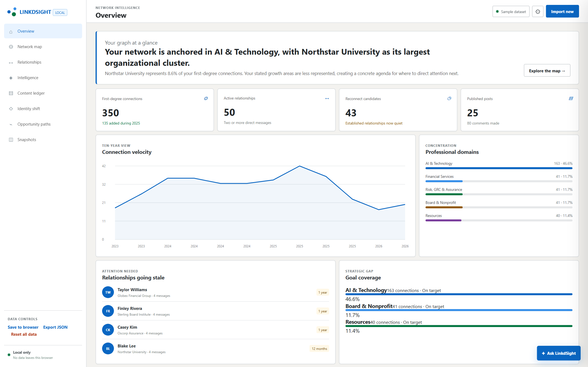

# LinkdSight

Import your LinkedIn data export and explore your professional network entirely in the browser. No accounts, no uploads, no trackers.

[**Live demo**](https://linkdsight.vercel.app) — click *Try sample data* to explore without an export

[](LICENSE)



## Features

- Network map with organizational and domain clusters, drill-down included
- Relationship ledger scored by reciprocity, recency, and staleness
- Content ledger, identity-shift timeline, and authority-signal gap analysis
- Opportunity paths: a job-search decision system with bridge routes and an action queue
- Deterministic offline advisor by default; every recommendation names its data and confidence

## Quick start

```bash
npm install
npm run dev      # http://localhost:5173
npm test
```

Drop your LinkedIn export ZIP on the import screen. `Connections.csv` and `messages.csv` drive the core views; ten more optional files (shares, positions, skills, …) enrich them — the app reports exactly which files it found, missed, or couldn't parse.

## Privacy

- The ZIP is parsed locally and kept in memory; derived data reaches IndexedDB only after explicit opt-in, and can be deleted anytime from Settings.
- No analytics, trackers, remote fonts, or CDN calls — all dependencies are bundled.
- The optional AI advisor is off by default, uses your own key (sessionStorage only), and shows you the exact minimized payload — no raw messages, names, or emails — before every send.

## License

[MIT](LICENSE)
